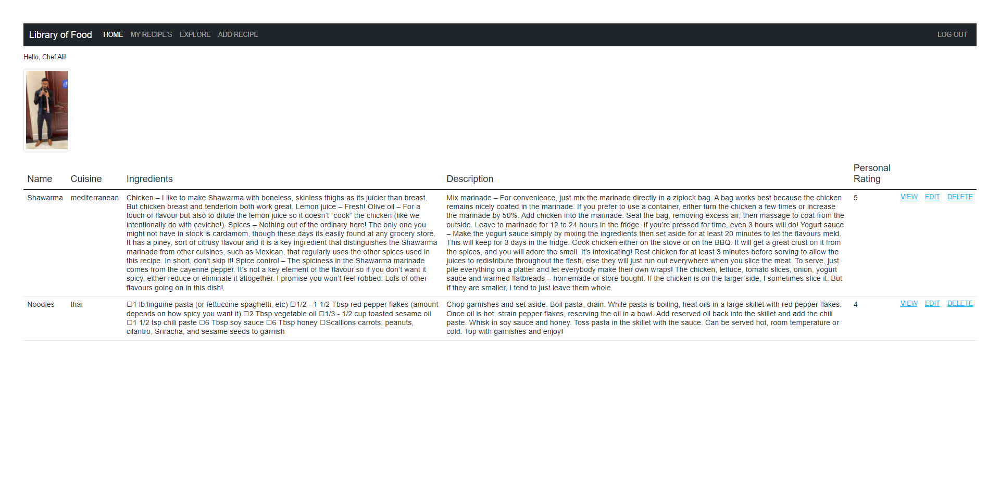
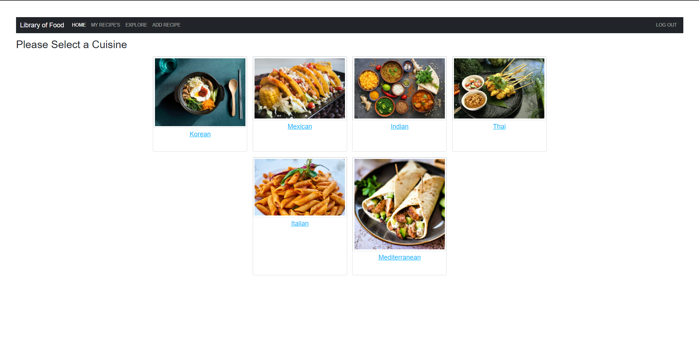
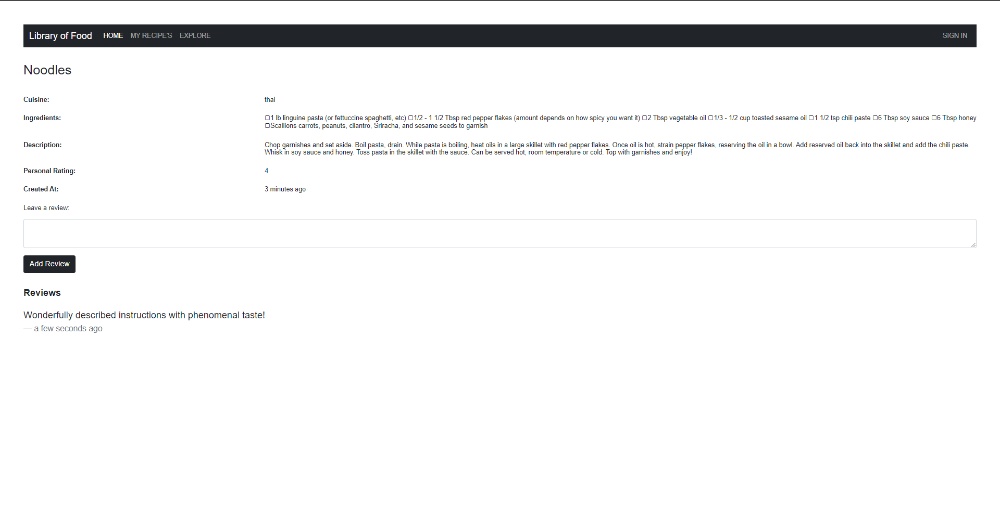

### Library of Food

Welcome everyone to the Library of Food!

This application hosts a veriety of different recipes from different people across a multitude of different cuisines!

Library of Food is a web app created to share recipes from different cuisines around the globe, with the opportunity to leave reviews on other user recipes as well.

You can also explore recipes sorted by specific cuisines incase you are in the mood for something particular that day.

Create your own recipes, review other people's recipes, enagage, be kind, and be adventerous!

## Screenshots:

---

---

---

---

## Technologies Used:

- HTML
- CSS
- JavaScript
- Node.js
- Express
- MongoDB
- Passport 
- Heroku
- Multer
- Connect Flash

## Getting Started 

### [Library of Food](https://libraryoffood.herokuapp.com/)

## Future Enhancements

- Allow users to delete their accounts.
- Allow users to edit their accounts.
- Allow users to search for recipes.
- Allow users to sort recipes with a page titled; "RECENT" that would show the most recent.
- Implement additional functionality for users to be able to rate other recipes.
- Implement a notification functionality that allows users to see reviews left on their recipe by other users.